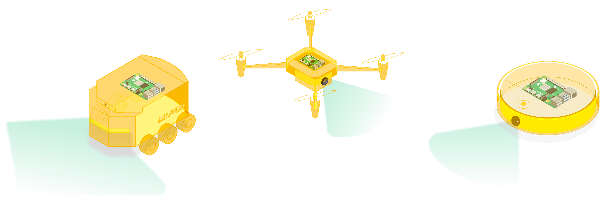
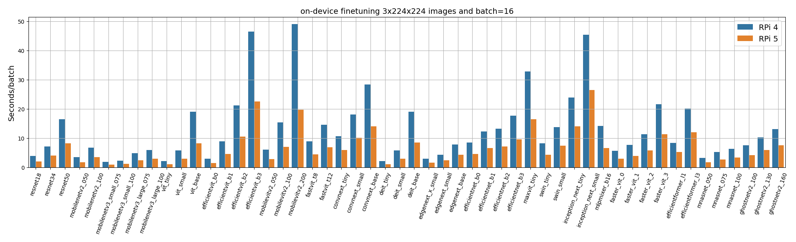

# Embedded Federated Vision




This repository contains the code used to benchmark several old and new vision models for image classification on the Raspberry Pi. Why do this? Embedded devices such as Raspberry Pi and alike have sufficient computing power to collaboratively train a wide range of vision models (so long memory peak is kept under control). You can read the blog post motivating this idea: [Raspberry Pi 5: Ready for Federated Vision](https://flower.dev/blog/2023-12-07-raspberrypi-is-ready-for-fl/).

The benchmark can be run on any Python environment for which PyTorch has support for. This means you can run it on your M2 Mac, your Linux workstation with NVIDIA GPUs, or your Raspberry Pi. This benchmark will evolve over time. Contributions are welcome.

In addition to the benchmark itself, here you'll find how to very effortlessly take any of the models in the benchmark and start your own federated finetuning experiments. 

> [!CAUTION]
> The content in this repository was written a while ago using an old version of Flower. It is **highly recommended** that you follow the [up-to-data tutorial instead](https://github.com/adap/flower/tree/main/examples/embedded-devices)! 

## Setup

The main packages that this repo uses are: [PyTorch](https://pytorch.org/), [timm](https://github.com/huggingface/pytorch-image-models), [Hydra](https://hydra.cc/) and [Flower](https://flower.dev/).
For setting up your Raspberry Pi, please follow the steps below. For other platforms, simply do `pip install -r requirements.txt` or `poetry install` after creating a Python 3.8+ environment

### Setting up your Raspberry Pi

These are the steps followed to get things ready to run the benchmark.

```bash
sudo apt-get update && sudo apt-get upgrade
sudo apt-get install build-essential libgl1 zlib1g-dev libssl-dev \
     libsqlite3-dev libreadline-dev libbz2-dev libffi-dev liblzma-dev

# Install pyenv
# More context here: https://github.com/pyenv/pyenv#basic-github-checkout
git clone https://github.com/pyenv/pyenv.git ~/.pyenv
# Update your dotfile
echo 'export PYENV_ROOT="$HOME/.pyenv"' >> ~/.bashrc
echo 'command -v pyenv >/dev/null || export PATH="$PYENV_ROOT/bin:$PATH"' >> ~/.bashrc
echo 'eval "$(pyenv init -)"' >> ~/.bashrc
source ~/.bashrc

# Install a modern version of python (3.8+)
pyenv install 3.9.17

# Install virtualenv pyenv plugin
# More context here: https://github.com/pyenv/pyenv-virtualenv
git clone https://github.com/pyenv/pyenv-virtualenv.git $(pyenv root)/plugins/pyenv-virtualenv
echo 'eval "$(pyenv virtualenv-init -)"' >> ~/.bashrc
# restart shell
exec "$SHELL"

# Create a virtual environment
pyenv virtualenv 3.9.17 embedded-fl-vision

# Activate your environment
pyenv activate embedded-fl-vision

# Clone this repo and cd into it

# Finally, install all packages
pip install -r requirements.txt
```

## Run Federated Learning

Files `server.py` and `client.py` have been borrowed from Flower's [`pytorch-quickstart`](https://github.com/adap/flower/tree/main/examples/quickstart-pytorch) example. Only the latter has been slightly modified so it integrates nicely with the Hydra configs in this repo.

What follows shows how to do federated finetuning of a model (any model in `conf/models`) using three Flower clients and a server. FL starts from an ImageNet pre-trained [`ViT (tiny)`](https://huggingface.co/timm/vit_tiny_patch16_224.augreg_in21k) model, then each client finetunes it to CIFAR-10, each using their own data partition. 

First, launch the server:
```bash
python server.py
```

Then, launch several clients (you'll need at least two). The CIFAR-10 dataset will be split into 5 disjoint partitions. This can be controlled via the `NUM_PARTITIONS` variable in `client.py`. More partitions will result in clients having less data (therefore training faster) but likely making the FL convergence slower.

```bash
python client.py node_id=0
# open a new terminal and launch other clients using
# a different node_id so they access a different data partition
```


If you want to run a different model you could do so by overriding the `model` config keyword:

```bash
python client.py node_id=<NODE-ID> model=fastvit_t8 # or any of the filenames in conf/model
```


## Run the Benchmark

Running the benchmark with default arguments will train and finetune all models listed in `conf/base.yaml` using `job.max_steps` batches. By default, an _in-memory_ dataset will be created by generating a small 1k-classes dataset à la ImageNet.


You can use the `plot.ipynb` notebook to generate the plot shown above. It will load the results in `results/blog`

```bash
# Run with default arguments
python main.py
# You can override config parameters easily. For example
# change the batchsize
python main.py dataset.prepare.batch_size=32 
```
Results are appended to a Pandas DataFrame once a model gets benchmarked. These results are also logged.

However, the benchmark ran to generate the results in the [blog post](https://flower.dev/blog/2023-12-07-raspberrypi-is-ready-for-fl/), used instead the command below. We used 20 batches for each task. We also loaded (randomly generated) images from the file system using the standard [`ImageFolder`](https://pytorch.org/vision/stable/generated/torchvision.datasets.ImageFolder.html) class. Some models are commented in `conf/base.yaml`. This is because the memory peak at training time exceeds 8GB (max available RAM on the Raspberry Pi) unless the batch size is reduced from 16 images.

```bash
python main.py job.max_steps=20 dataset_fs=in_fs

# On a Raspberry Pi 5 you should see a the gradual construction of dataframe similar to this
t_finetune  finetune_batches     t_train  train_batches                  model  num_classes  num_images    input_shape  parameters  gmacs   top1   top5
0    41.587301                20  116.850590             20               resnet18         1000        1000  [3, 224, 224]        11.7   1.80  69.76  89.07
1    80.164873                20  219.803324             20               resnet34         1000        1000  [3, 224, 224]        21.8   3.68  73.31  91.42
2   164.089985                20  322.258574             20               resnet50         1000        1000  [3, 224, 224]        35.6   4.10  78.05  93.78
3    35.413975                20   73.653456             20        mobilenetv2_050         1000        1000  [3, 224, 224]         2.0   0.10  65.95  86.08
4    69.696616                20  144.351003             20        mobilenetv2_100         1000        1000  [3, 224, 224]         6.1   0.60  72.97  91.02
5    20.326630                20   39.685945             20  mobilenetv3_small_075         1000        1000  [3, 224, 224]         2.0   0.04  65.40    NaN
6    24.748851                20   47.392619             20  mobilenetv3_small_100         1000        1000  [3, 224, 224]         2.5   0.06  67.40    NaN
7    48.638736                20   95.654774             20  mobilenetv3_large_075         1000        1000  [3, 224, 224]         4.0   0.12  73.30    NaN
8    58.806691                20  114.605145             20  mobilenetv3_large_100         1000        1000  [3, 224, 224]         5.5   0.20  75.20    NaN
9    22.941065                20   59.784251             20               vit_tiny         1000        1000  [3, 224, 224]         5.7   1.10  75.46  92.84
10   59.059623                20  165.038253             20              vit_small         1000        1000  [3, 224, 224]        21.7   4.30  78.85  94.29
11  165.776707                20  470.386445             20               vit_base         1000        1000  [3, 224, 224]        85.8  16.90  79.15  94.09
12   30.442981                20   64.879561             20        efficientvit_b0         1000        1000  [3, 224, 224]         3.4   0.10    NaN    NaN
13   91.025576                20  198.981715             20        efficientvit_b1         1000        1000  [3, 224, 224]         9.1   0.50  79.39  94.35
14  211.585541                20  456.304587             20        efficientvit_b2         1000        1000  [3, 224, 224]        24.3   1.60  82.10  95.78
15  452.639301                20  930.202626             20        efficientvit_b3         1000        1000  [3, 224, 224]        48.6   4.00  83.47  96.36
```

You can run the benchmark on your NVIDIA GPU by simply passing appending `device=cuda`. Please not that getting precise per-batch timings is not implemented yet.


## TODO

- Validate GPU readiness.
- Use [cuda.Events](https://pytorch.org/docs/stable/generated/torch.cuda.Event.html) for proper per-batch time statistics on GPU.
- Add NVIDIA Jetson support.
- Support un-/semi-/self-suppervised learning tasks.

